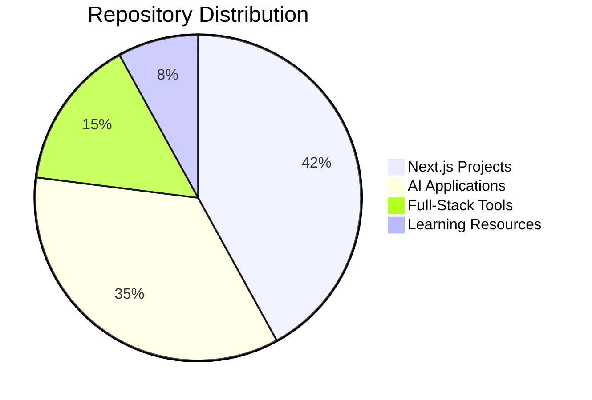

👋 Hi, I’m @elijahnzeli1  
💻 Full-Stack Developer | AI Enthusiast | Next.js Specialist | React-Native | Flutter  
📍 Nairobi, Kenya  

## 🌐 Socials:
    

## **Visitors**

## 📊 Contribution Graph

## 📊 Advanced GitHub Analytics for this Year

<table align="center">
  <tr>
    <td width="50%">
      
    </td>
  </tr>
  <tr>
    <td width="50%">
      
    </td>
    <td width="50%">
      
    </td>
  </tr>
  <tr>
    <td colspan="2">
      
    </td>
  </tr>
</table>

# 💻 Tech Stack:
                                         
# 📊 GitHub Stats:
 
 

## 🏆 GitHub Trophies

### ✍️ Random Dev Quote

### 🔝 Top Contributed Repo

---

<!-- Proudly created with GPRM ( https://gprm.itsvg.in ) -->
## 🔍 Repository Insights

<!-- ## 📊 GitHub Analytics for all the Years -->
<!-- Alternative Stats -->
<!--  -->

<!-- Alternative Top Langs -->
<!--  -->

## 🤖 GitHub Copilot Usage

## 🛠️ Technical Expertise

### **Frontend**  

### **Backend**  

### **AI & ML**  

### **Tools**  

## 🌱 Current Focus

- Building Next.js applications with TypeScript
- Developing AI-integrated web solutions
- Exploring generative AI model fine-tuning
- Contributing to open-source AI projects

## 💞️ Collaboration Interests

- Next.js/TypeScript framework development
- AI-driven web applications
- Open-source AI tooling
- Innovative SaaS products

## 📈 Recent Projects

## 📬 Let's Connect

I'm always open to discussing:
- New project opportunities
- Technical collaborations
- AI research initiatives
- Developer communities in Africa

Reach out via [email](mailto:elijahnzeli924@gmail.com) or [WhatsApp](https://wa.me/+254741905247)

<!--- 
elijahnzeli1/elijahnzeli1 is a ✨ special ✨ repository
--->
